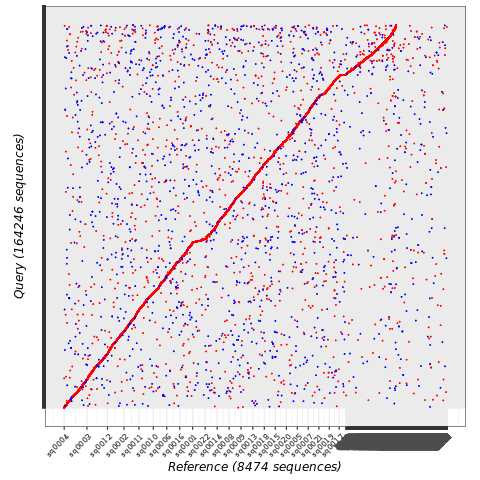

# mplotter
Creates publication quality dot plot from nucmer .delta output using ggplot2

* mplotter.cpp slightly adapted from the original code
  * Compile the .cpp file on your platform with: *c++ mplotter.cpp -o mplotter*
* added bash script to run all original commands in one GO
* added plotting in the bash script

To run the script, move to the folder containing the nucmer .delta file and launch the bash script

**mummer2ggplot2.sh nucmer.delta**

After running, the R script can be tuned to change aspect and legends and re-run

required: 

* mummer4 (https://github.com/mummer4/mummer)
* mplotter (our version) and mummer2ggplot2.sh in the PATH and both executable
* R and ggplot2 available

example output

Please report any inconsistencies in the *Issues* page above
